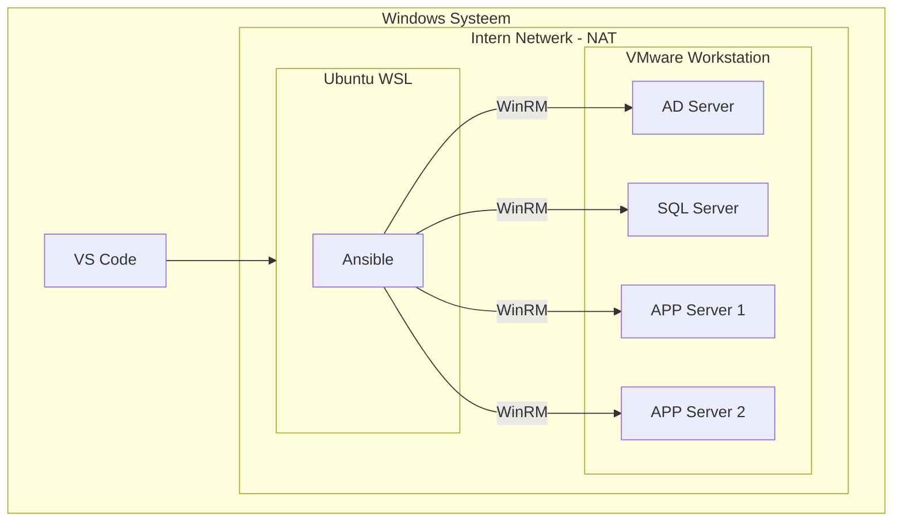

# Installatie van POC omgeving

Deze instructie beschrijft hoe een POC omgeving op te zetten voor het testen van de ansible playbooks in deze repository.

## Vereisten
De POC omgeving heeft de volgende systeemeisen:
* Windows 10 of Windows 11
  * Linux zou eventueel ook kunnen, maar dit vereist een kleine aanpassing in de playbooks `start-lab.yml` en `shutdown-lab.yml`.
* VMware workstation
  * Dit is tegenwoordig gratis te gebruiken, [ook voor zakelijke gebruikers,](https://blogs.vmware.com/cloud-foundation/2024/11/11/vmware-fusion-and-workstation-are-now-free-for-all-users/). Dit in tegenstelling tot bijvoorbeeld [virtualbox](https://forum.virtualbox.org/wiki/Licensing_FAQ).
* Een VM met Windows server, geconfigureerd met de AD DS rol en een statisch IP adres.
* Een VM met Windows server, geconfigureerd als member server en een installatie van SQL Server.
* Een of meerdere VMs met Windows server, geconfigureerd als member servers ten behoeve van de DevOps server applicatie.

Schematisch ziet deze setup er als volgt uit:



## Provisioning ansible worker
### Systeem packages

To install the Kerberos libraries on a RHEL/Fedora based system:
```bash
sudo dnf install krb5-devel krb5-libs krb5-workstation python3-devel
```

For a Debian/Ubuntu based system:

```bash
sudo apt-get update && sudo apt-get install -y gcc git krb5-user libkrb5-dev python3 python3-dev python3-pip python3-venv
```

Uitzoeken hoe deze instellingen te automatiseren:
* Default kerberos 5 realm (azdopoc.localdomain)
* Kerberos servers (azdo-adserver.azdopoc.localdomain)
* Administrative server (azdo-adserver.azdopoc.localdomain)

Voor deze instellingen krijg je momenteel een prompt.

### Python setup

#### Setup virtual environment en shell
Pas voor je hiermee aanvangt de omgevingsvariablen `VENV_DIR` en `REPO_DIR` aan naar de gewenste paden.

```bash
cd ~
export VENV_DIR=~/pgb-ansible
python3 -m venv $VENV_DIR
sh -c 'echo "\n# Start python virtual environment\nsource $VENV_DIR/bin/activate" >> ~/.bashrc'
source ~/.bashrc
export REPO_DIR=~/pgb-azdo
mkdir $REPO_DIR
sh -c 'echo "# Custom aliases\nalias start-lab=\"ansible-playbook $REPO_DIR/playbooks/start-lab.yml -i $REPO_DIR/inventory/dev/hosts.yml\"\nalias shutdown-lab=\"ansible-playbook $REPO_DIR/playbooks/shutdown-lab.yml -i $REPO_DIR/inventory/dev/hosts.yml\"" >> ~/.bash_aliases'
```

### Clone repository
Om de code uit de repository uit te kunnen voeren, maar bijvoorbeeld ook de setup van ansible af te maken zal deze gekloond moeten worden vanuit de bron server.

#### Git setup
```bash
git config --global user.name "Your Name"
git config --global user.email "youremail@yourdomain.com"
git config --global credential.helper "/mnt/c/Program\ Files/Git/mingw64/bin/git-credential-manager.exe"
git config --global credential.https://dev.azure.com.useHttpPath true
```

Als de setup van git gedaan is dan kan de repository gekloond worden. Stel hiertoe wel eerst de omgevingsvariabele `REPO_REMOTE` in naar het URL van jouw repository.
```bash
export REPO_REMOTE=https://server/project/repository.git
git clone $REPO_REMOTE .
```

#### Secrets file
| ⚠️ WARNING             |
|:------------------------|
| Dit is zeer belangrijk  |

De repository verwacht een bestand met secrets op deze locatie `../../pgb-secrets/vault.yml`. Zorg dat dit bestand bestaat met de juiste inhoud.

### Ansible setup
In de repository bevind zich een bestand waarin alle benodigde python modules staan benodigd voor de installatie van ansible, inclusief de installatie van ansible zelf.
```bash
python3 -m pip install --upgrade -r $REPO_DIR/provisioning/requirements.txt
```

Controleer of dit gewerkt heeft door de versie van ansible te installeren.
```bash
ansible --version
```

Controleer of de community.windows collection is geïnstalleerd.
```bash
ansible-galaxy collection list community.windows
```

### WSL Setup
#### Gebruik DNS Server(s) van lab omgeving

Neem deze config op in `/etc/wsl.conf`
```bash
sudo sh -c 'echo "[network]\ngenerateResolvConf = false" >> /etc/wsl.conf'
```
Stop WSL.
```bat
wsl --shutdown
```
Als je meerdere distributies geïnstalleerd hebt kun je eerst de lijst van actieve distributies opvragen met:
```bat
wsl --list --running
```
En sluit de gewenste distributie af met:
```bat
wsl --terminate DistroNaam
```
Herstart WSL, verwijder de symbolic link voor `/etc/resolv.conf` en maak een nieuw bestand aan
```bash
sudo rm /etc/resolv.conf && sudo vi /etc/resolv.conf
```
Voeg de DNS servers en domein(en) toe die in je POC omgeving gebruikt worden.
```bash
nameserver 192.168.147.10
search azdopoc.localdomain
```
Test nu of je een van de servers in de POC omgeving kunt benaderen.
```bash
ping -c 3 azdo-adserver.azdopoc.localdomain
```
### Ansible testen
Controleer of je met ansible de inventory kunt opvragen.
```bash
export REPO_DIR=~/pgb-azdo
ansible-inventory -i $REPO_DIR/inventory/dev/hosts.yml --list
```
Controleer of je met ansible de facts van de servers in de inventory kunt opvragen.
```bash
ansible-playbook $REPO_DIR/playbooks/test-connectivity.yml -i $REPO_DIR/inventory/dev/hosts.yml
```