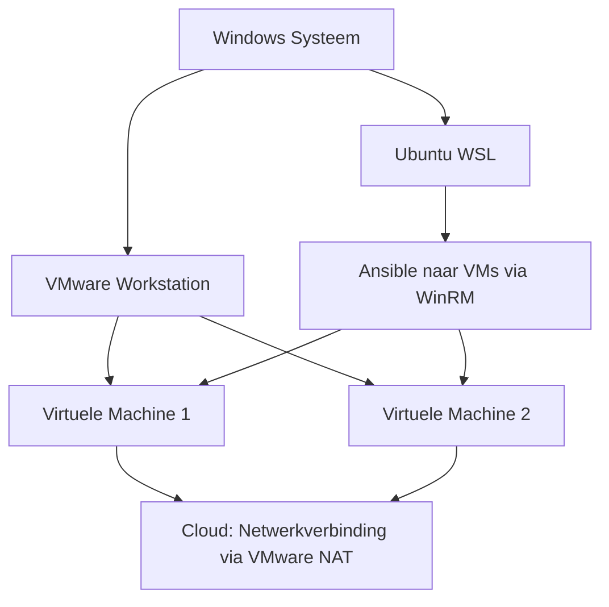

```mermaid
graph TD
    A[Windows Systeem] --> B[Ubuntu WSL]
    A --> C[VMware Workstation]
    C --> D[Virtuele Machine 1]
    C --> E[Virtuele Machine 2]
    D --> F[Cloud: Netwerkverbinding via VMware NAT]
    E --> F
    B --> G[Ansible naar VMs via WinRM]
    G --> D
    G --> E
```
